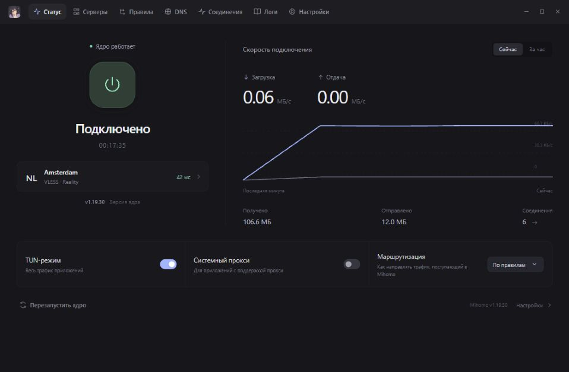
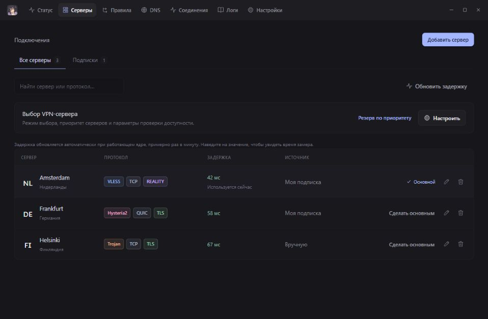
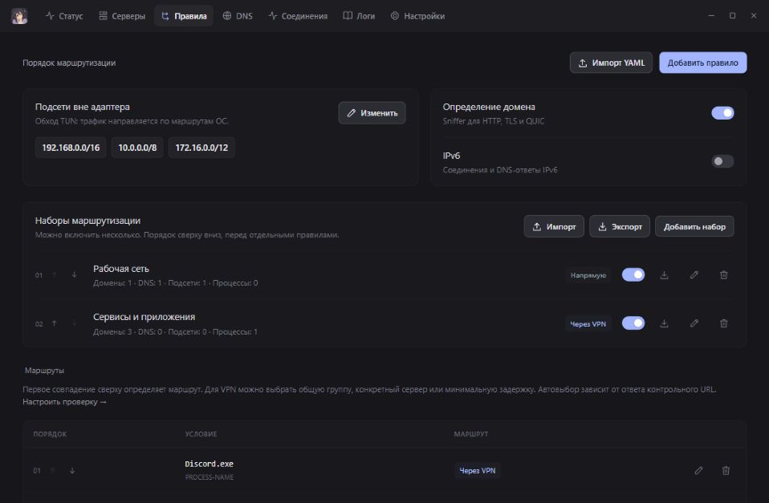
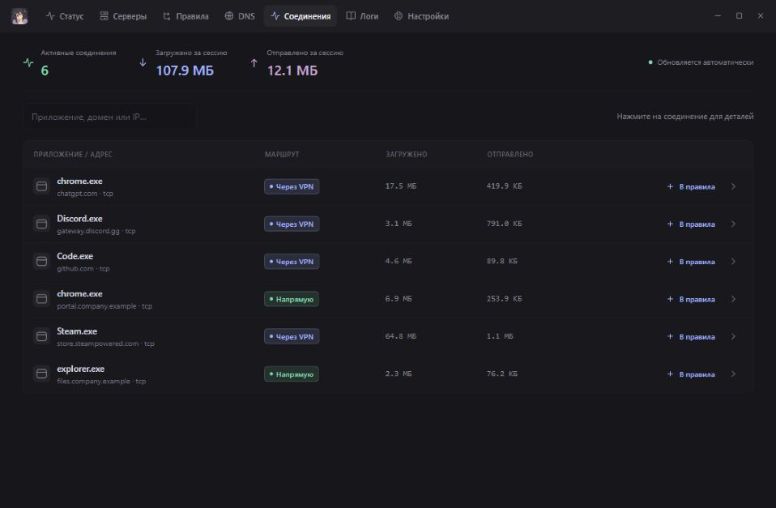

<p align="center"></p>
<h1 align="center">Yoru</h1>
<p align="center">Ваши серверы. Ваши правила. Один интерфейс.</p>
<p align="center">
  <a href="https://github.com/d0kur0/Yoru/releases/latest"></a>
  <a href="https://github.com/d0kur0/Yoru/actions/workflows/release.yml"></a>
  
</p>
<p align="center">
  <a href="https://github.com/d0kur0/Yoru/releases/latest"><b>Скачать</b></a> ·
  <a href="#интерфейс">Интерфейс</a> ·
  <a href="docs/DEVELOPMENT.md">Разработка</a> ·
  <a href="docs/RELEASING.md">Релизы</a> ·
  <a href="https://github.com/d0kur0/Yoru/issues">Сообщить об ошибке</a>
</p>

Yoru — desktop-клиент для [Mihomo](https://github.com/MetaCubeX/mihomo). Подключайте свои серверы и подписки, выбирайте маршрут для приложений и доменов, настраивайте DNS и смотрите активные соединения. Ядро уже включено в установщик.



## Что умеет

| | |
| --- | --- |
| **Серверы и подписки** | Импорт ссылок, Base64 и Mihomo YAML. VLESS/Reality, VMess, Trojan, Shadowsocks, Hysteria2, TUIC, WireGuard и другие поддержанные импортёром форматы. |
| **Автоматический выбор** | Резерв по приоритету, минимальная задержка, балансировка или ручной выбор. URL и параметры проверки настраиваются. |
| **Маршрутизация** | Через VPN, напрямую или блокировать — для домена, IP или процесса. Можно закрепить конкретный сервер за правилом. |
| **Наборы правил** | Объединяйте домены, приложения, DNS и подсети. Включайте набор одним переключателем, импортируйте и экспортируйте JSON. |
| **DNS и TUN** | Fake-IP, реальные IP, DNS для отдельных доменов и подсети вне адаптера. TUN и системный прокси переключаются без ручного переподключения. |
| **Диагностика** | Автозамер задержки, активные соединения, трафик и журналы. Добавление приложения в правила прямо из соединений. |

Русский интерфейс, тёмная и светлая темы, трей, автозапуск и автоподключение. Yoru не предоставляет VPN-серверы: потребуется ваш сервер или подписка.

## Установка

В [последнем релизе](https://github.com/d0kur0/Yoru/releases/latest) выберите файл для своей системы:

| Система | Файл | Как установить |
| --- | --- | --- |
| Windows x64 | `Yoru-…-windows-x64-setup.exe` | Запустите установщик. При необходимости он установит WebView2. |
| macOS · Apple Silicon | `Yoru-…-macos-arm64.dmg` | Откройте образ и перетащите Yoru в Applications. |
| macOS · Intel | `Yoru-…-macos-x64.dmg` | Откройте образ и перетащите Yoru в Applications. |

Текущие сборки без сертификата издателя Windows и без notarization Apple; macOS-приложение подписано ad-hoc. ОС может запросить разрешение на запуск или заблокировать его стандартной проверкой доверия. Контрольные суммы файлов находятся в `SHA256SUMS.txt` рядом с установщиками.

После установки:

1. Откройте **Серверы** и добавьте сервер или подписку.
2. Выберите основной сервер. В **Настроить** задайте автоматический резерв, если он нужен.
3. На странице **Статус** включите TUN или системный прокси и подключитесь. Для TUN нужны соответствующие права ОС.
4. В режиме **По правилам** настройте маршруты. По умолчанию остальной трафик идёт напрямую.

## Интерфейс

Скриншоты сняты с настоящего интерфейса на демонстрационных данных. Адреса, подписки, ключи и рабочие домены пользователей не используются; показатели трафика и задержки иллюстративные.

<details open>
<summary><b>Серверы — протоколы, источники подписок и задержка</b></summary>



</details>

<details>
<summary><b>Правила — наборы маршрутизации и исключения TUN</b></summary>



</details>

<details>
<summary><b>Соединения — приложения, маршруты и трафик</b></summary>



</details>

## Сборка и документация

Стек: **Go · Wails v3 · Vite · Mihomo**. Быстрый старт из исходников:

```sh
git clone https://github.com/d0kur0/Yoru.git
cd Yoru
go install github.com/wailsapp/wails/v3/cmd/wails3@v3.0.0-beta.8
wails3 build
```

Нужны Go 1.25+, Node.js 24.10+ и платформенные зависимости Wails. Подробности:

- [Разработка, проверки и деморежим для скриншотов](docs/DEVELOPMENT.md).
- [Версионирование, CI и выпуск установщиков](docs/RELEASING.md).
- [DNS и совместимость с другими VPN](docs/DNS.md).
- [История изменений](CHANGELOG.md).

Основная платформа ручной проверки — Windows. CI собирает и проверяет код на Windows и двух архитектурах macOS; это не заменяет проверку TUN и сетевых интеграций на реальном Mac. Linux-сборка предусмотрена, но в текущую матрицу релизов не входит.

## Где лежат настройки

Для совместимости с ранними версиями каталог данных сохранил прежнее имя:

| Система | Каталог |
| --- | --- |
| Windows | `%APPDATA%/MihomoDesktop` |
| macOS | `~/Library/Application Support/MihomoDesktop` |
| Linux | `MihomoDesktop` внутри `os.UserConfigDir()` |

`config.json` содержит настройки и ключи серверов, `runtime/config.yaml` — конфигурацию ядра. Журналы ротируются по размеру и сроку хранения. Настройки темы ранних сборок остаются в каталоге `Tiho`; прежние резервные копии поддерживаются.

Экспорт настроек и URL подписки могут содержать секреты. Перед публикацией issue удаляйте их из файлов и скриншотов.

Mihomo работает отдельным процессом. Его лицензия GPL-3.0 и ссылка на исходники находятся в [уведомлении о встроенном ядре](internal/bundled/payload/NOTICE.txt); лицензии сторонних UI-ресурсов — в [third-party](third-party).
