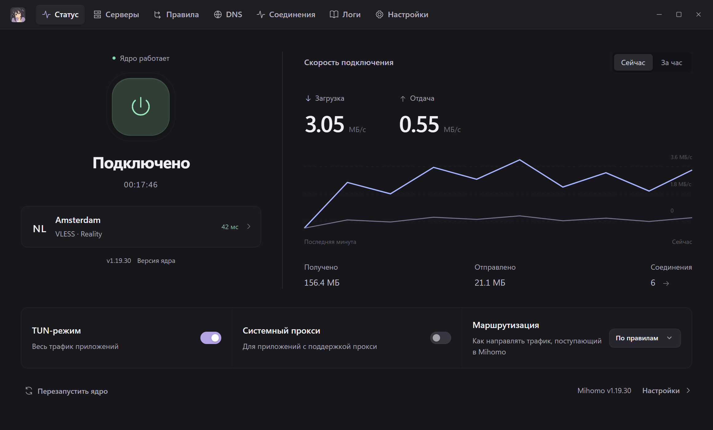
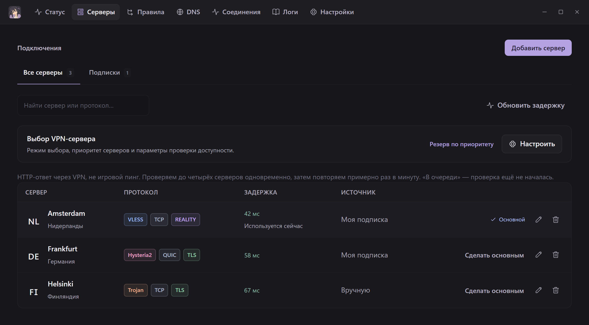
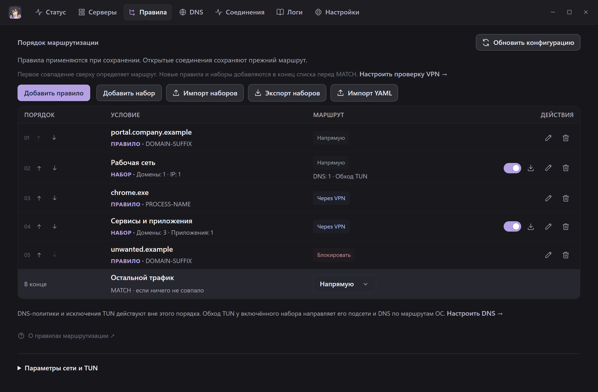
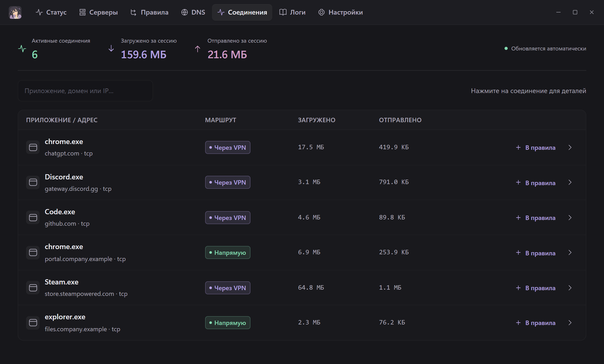

<p align="center"></p>
<h1 align="center">Yoru</h1>
<p align="center">Ваши серверы. Ваши правила. Один интерфейс.</p>
<p align="center">
  <a href="https://github.com/d0kur0/Yoru/releases/latest"></a>
  <a href="https://github.com/d0kur0/Yoru/actions/workflows/release.yml"></a>
  
</p>
<p align="center">
  <a href="https://github.com/d0kur0/Yoru/releases/latest"><b>Скачать</b></a> ·
  <a href="#cisco-vpn-и-yoru">Cisco VPN</a> ·
  <a href="docs/MACOS.md">macOS и TUN</a> ·
  <a href="#интерфейс">Интерфейс</a> ·
  <a href="docs/DEVELOPMENT.md">Разработка</a> ·
  <a href="docs/RELEASING.md">Релизы</a> ·
  <a href="https://github.com/d0kur0/Yoru/issues">Сообщить об ошибке</a>
</p>

Yoru — desktop-клиент для [Mihomo](https://github.com/MetaCubeX/mihomo). Подключайте свои серверы и подписки, выбирайте маршрут для приложений и доменов, настраивайте DNS и смотрите активные соединения. Ядро уже включено в установщик.



## Что умеет

| | |
| --- | --- |
| **Серверы и подписки** | Импорт ссылок, Base64 и Mihomo YAML. VLESS/Reality, VMess, Trojan, Shadowsocks, Hysteria2, TUIC, WireGuard и другие поддержанные импортёром форматы. |
| **Автоматический выбор** | Резерв по приоритету, минимальная задержка, балансировка или ручной выбор. URL и параметры проверки настраиваются. |
| **Маршрутизация** | Правила и наборы в одной очереди: перемещайте любую строку выше или ниже другой. Через VPN, напрямую или блокировать — для домена, IP или процесса. Можно закрепить конкретный сервер за правилом. |
| **Наборы правил** | Объединяйте домены, приложения, DNS и подсети. Включайте набор одним переключателем, импортируйте и экспортируйте JSON. |
| **DNS и TUN** | Fake-IP, реальные IP, DNS для отдельных доменов и подсети вне адаптера. TUN и системный прокси переключаются без ручного переподключения. |
| **Диагностика** | Автозамер задержки, активные соединения, трафик и журналы. Добавление приложения в правила прямо из соединений. |

Русский интерфейс, тёмная и светлая темы, трей, автозапуск и автоподключение. Yoru не предоставляет VPN-серверы: потребуется ваш сервер или подписка.

## Установка

В [последнем релизе](https://github.com/d0kur0/Yoru/releases/latest) выберите файл для своей системы:

| Система | Файл | Как установить |
| --- | --- | --- |
| Windows x64 | `Yoru-…-windows-x64-setup.exe` | Запустите установщик. При необходимости он установит WebView2. Yoru запрашивает права администратора при запуске. |
| macOS · Apple Silicon | `Yoru-…-macos-arm64.dmg` | Откройте образ и перетащите Yoru в Applications. |
| macOS · Intel | `Yoru-…-macos-x64.dmg` | Откройте образ и перетащите Yoru в Applications. |

Текущие сборки без сертификата издателя Windows и без notarization Apple; macOS-приложение подписано ad-hoc. ОС может запросить разрешение на запуск или заблокировать его стандартной проверкой доверия. Контрольные суммы файлов находятся в `SHA256SUMS.txt` рядом с установщиками.

После установки:

1. Откройте **Серверы** и добавьте сервер или подписку.
2. Выберите основной сервер. В **Настроить** задайте автоматический резерв, если он нужен.
3. На странице **Статус** включите TUN или системный прокси и подключитесь. Для TUN нужны соответствующие права ОС.
4. В режиме **По правилам** настройте маршруты. По умолчанию остальной трафик идёт напрямую.

На macOS запускайте Yoru из Applications или Launchpad от своего пользователя. При подключении с TUN приложение показывает системный запрос пароля администратора для отдельного процесса ядра; окно и настройки остаются под вашим пользователем. Новое подключение может снова запросить пароль. Подробности и восстановление прав после прежнего запуска через `sudo` описаны в [инструкции macOS](docs/MACOS.md).

## Cisco VPN и Yoru

Если Cisco Secure Client / AnyConnect подключён, а рабочие домены через Yoru не открываются или DNS отвечает с задержкой, закрепите корпоративный DNS за интерфейсом Cisco. В Yoru 1.4.1+ адрес DNS можно записать как `IP#имя_интерфейса`; IP самого VPN-адаптера не обязательно является адресом DNS.

1. Подключите Cisco и узнайте выданные им DNS, точное имя виртуального интерфейса и маршруты к рабочим сетям.
2. В **Правила → Добавить набор** укажите рабочие зоны во вкладке **Домены**, серверы вида `192.0.2.53#Ethernet 2` во вкладке **DNS**, нужные сети во вкладке **IP и подсети**. Выберите **Напрямую**, включите **Реальные IP для доменов** и **Обход TUN**. Здесь `192.0.2.53` и `Ethernet 2` — только пример: замените оба значения своими.
3. Поднимите набор выше общих правил **Через VPN**, сохраните и включите на странице **Статус** режим **По правилам**. Если Yoru показывает ожидающее изменение TUN, перезапустите ядро.

На macOS вместо `Ethernet 2` нужен фактический интерфейс Cisco, обычно `utunN`; его номер может измениться после переподключения. DNS и обход TUN набора действуют отдельно от порядка правил. Проверяйте рабочее имя и HTTPS при одновременно подключённых Cisco и Yoru; домен шлюза Cisco должен разрешаться ещё до входа в Cisco. Команды для поиска интерфейса, подробный пример и ограничения — в [инструкции по DNS](docs/DNS.md#cisco-secure-client--anyconnect).

## Интерфейс

Скриншоты сняты с настоящего интерфейса на демонстрационных данных. Адреса, подписки, ключи и рабочие домены пользователей не используются; показатели трафика и задержки иллюстративные.

<details open>
<summary><b>Серверы — протоколы, источники подписок и задержка</b></summary>



</details>

<details>
<summary><b>Правила — единый порядок маршрутизации</b></summary>



</details>

<details>
<summary><b>Соединения — приложения, маршруты и трафик</b></summary>



</details>

## Сборка и документация

Стек: **Go · Wails v3 · Vite · Mihomo**. Быстрый старт из исходников:

```sh
git clone https://github.com/d0kur0/Yoru.git
cd Yoru
go install github.com/wailsapp/wails/v3/cmd/wails3@v3.0.0-beta.8
wails3 build
```

Нужны Go 1.25+, Node.js 24.10+ и платформенные зависимости Wails. Подробности:

- [Разработка, проверки и деморежим для скриншотов](docs/DEVELOPMENT.md).
- [Версионирование, CI и выпуск установщиков](docs/RELEASING.md).
- [DNS и совместимость с другими VPN](docs/DNS.md).
- [Запуск на macOS, права TUN и проверка подключения](docs/MACOS.md).
- [Порядок правил и наборов](docs/ROUTING.md).
- [История изменений](CHANGELOG.md).

Основная платформа ручной проверки — Windows. CI собирает и проверяет код на Windows и двух архитектурах macOS; это не заменяет проверку TUN и сетевых интеграций на реальном Mac. Linux-сборка предусмотрена, но в текущую матрицу релизов не входит.

## Где лежат настройки

| Система | Каталог |
| --- | --- |
| Windows | `%APPDATA%/Yoru` |
| macOS | `~/Library/Application Support/Yoru` |
| Linux | `Yoru` внутри `os.UserConfigDir()` |

`config.json` содержит настройки и ключи серверов, `runtime/config.yaml` — конфигурацию ядра. Журналы ротируются по размеру и сроку хранения.

Экспорт настроек и URL подписки могут содержать секреты. Перед публикацией issue удаляйте их из файлов и скриншотов.

Mihomo работает отдельным процессом. Его лицензия GPL-3.0 и ссылка на исходники находятся в [уведомлении о встроенном ядре](internal/bundled/payload/NOTICE.txt); лицензии сторонних UI-ресурсов — в [third-party](third-party).
