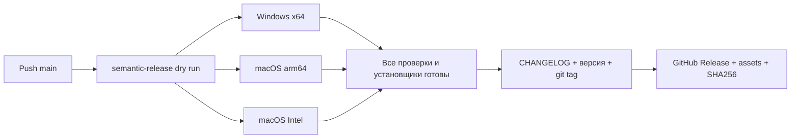

# Релизы Yoru

Версии определяет semantic-release по Conventional Commits в `main`. Версия вручную не повышается; теги создаёт CI.

| Коммит | Выпуск |
| --- | --- |
| `fix: correct server latency` | Patch: `1.0.0` → `1.0.1` |
| `feat: add routing presets` | Minor: `1.0.0` → `1.1.0` |
| `feat!: change configuration format` или footer `BREAKING CHANGE:` | Major: `1.0.0` → `2.0.0` |
| `docs:`, `ci:`, `test:`, `chore:` | Без нового релиза, если нет других значимых коммитов |

Первый выпуск без предшествующего тега получает `1.0.0`. При squash merge используйте Conventional Commit в заголовке итогового коммита.

## Pipeline

[Build and release](../.github/workflows/release.yml) запускается на push в `main`, pull request и вручную через GitHub Actions.

Каждый build job устанавливает зависимости из lock-файла, запускает JavaScript-тесты, сборку frontend, `go test ./...` и `go vet ./...`. Затем скачивает Mihomo целевой архитектуры, встраивает его в приложение и собирает NSIS EXE или DMG. На macOS проверяются ad-hoc подпись приложения и целостность образа; на Windows — версия EXE.

Pull request проверяет все три платформы и сохраняет установщики как временные Actions artifacts, но не публикует релиз. Push без изменения версии также выполняет проверки и сборку. Artifacts хранятся 14 дней.

`version` рассчитывает следующую версию до компиляции. `scripts/version.mjs` записывает её в UI, npm-манифесты и lock-файлы, Wails metadata, Windows EXE/NSIS и macOS plist. `release` повторно проверяет рассчитанную версию и наличие трёх установщиков. Если версия изменилась или не хватает файла, публикация прерывается.

Публикация выполняется в том же workflow после всех сборок. Она не зависит от запуска второго workflow на bot-created tag. semantic-release формирует release notes, обновляет `CHANGELOG.md`, коммитит метаданные с `[skip ci]`, создаёт `vX.Y.Z` и загружает установщики с SHA-256 суммами.

## Доступ и подпись

Достаточно встроенного `GITHUB_TOKEN`; отдельные npm/PAT-токены не нужны. Только jobs `version` и `release` получают `contents: write`. Комментарии к issues/PR выключены. Сборки используют `contents: read`.

В репозитории должны быть включены Actions. Если правила защиты `main` запрещают push от Actions, потребуется разрешить release-боту обновление метаданных либо изменить схему публикации; workflow не обходит защиту ветки.

Сейчас Windows EXE не подписан сертификатом издателя, macOS использует ad-hoc подпись без notarization. Developer ID, Apple notarization и Authenticode не настроены: для них нужны сертификаты и учётные данные владельца. Это явно указано в README и каждом GitHub Release.

## Повтор неудачного запуска

Если упала сборка до публикации, исправьте причину и отправьте коммит в `main` или повторите failed jobs. До успешной сборки всех платформ новый тег не создаётся.

Если ошибка произошла уже после создания тега, сначала проверьте тег, release и загруженные assets. semantic-release не пересоздаёт существующую версию автоматически; восстановите отсутствующие assets из artifacts того же запуска или выпустите исправление следующим `fix:`-коммитом. Не загружайте сборки другой версии под существующий тег.
